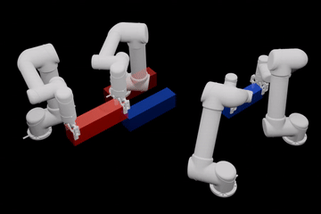
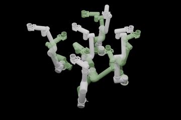
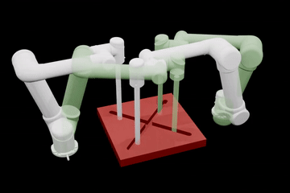

# Manifold-constrained Hamilton-Jacobi Reachability Learning for Decentralized Multi-Agent Motion Planning
[Paper](https://ieeexplore.ieee.org/document/11697252) | [arXiv](https://arxiv.org/abs/2511.03591) | [Video Demo](https://youtu.be/RYcEHMnPTH8)

<table>
    <td align="center">
      
    </td>
    <td align="center">
      
    </td>
    <td align="center">
      
    </td>
  </tr>
</table>

## Introduction
We present HaMMAR, Hamilton–Jacobi with Manifold constraints for Multi-Agent Reachability, a framework that learns manifold-constrained HJR for decentralized multi-agent motion planning. Our method solves HJR problems under manifold constraints to capture task-aware safety conditions, which are then integrated into a decentralized trajectory optimization planner. This enables robots to generate motion plans that
are both safe and task-feasible without requiring assumptions about other agents’ policies. Our approach generalizes across diverse manifold-constrained tasks and scales effectively to high-dimensional multi-agent manipulation problems. 

## Dependency
- Python 3.11 is used in this project.
- Run `pip install -r requirements.txt` to collect all python dependencies.
- [zonopy](https://github.com/roahmlab/zonopy) and [zonopy-robot](https://github.com/roahmlab/zonopy-robots) are required by the simulation environment. Please refer to their respective repositories following the hyperlinks for insllation instructions.
###


## Reproducing Results
### Planning Experiments
 - To download the trained HJR models from Google Drive:
```
pip install gdown
gdown --folder https://drive.google.com/drive/folders/1qr1Zprp9e2qv_3Do3QsTpskA2jz5wuAL?usp=sharing
```

 - To run the planning experiments:
```
bash planning_scripts/run_dual_UR5_cup_planning.sh         # Dual UR5 Cup Planning
bash planning_scripts/run_three_UR5_cup_planning.sh        # Three UR5 Cup Planning
bash planning_scripts/run_five_UR5_cup_planning.sh         # Five UR5 Cup Planning

bash planning_scripts/run_object_planning.sh               # Object Carrying Planning
bash planning_scripts/run_doorway_planning.sh              # Doorway problem Planning
```
For visulizations, the user may specify the `--video` flag in the bash scripts. The experiments will generate planning results as a JSON file under `planning_results/`. To save planned trajectories, the user may substitute `--save_stats` with `--save_traj`.


### BRS Comparison Expriments
 - To run the BRS comparison experiment, 
 ```
 python deepreach/validation_scripts/compare_2D_value_func.py        # make BRS comparison plot, output file available under ./
 python deepreach/validation_scripts/compute_2D_value_func_score.py  # collect comparision statistics such as accuracy
 ```


### Training the HJR models
 - To download the boundary condition networks for manipulator examples, 
 ```
 gdown --folder https://drive.google.com/drive/folders/1MIE9rrUF7KDzWxW70Aq0LA-5j-RLP6vI?usp=sharing -O UR5_datasets_and_training/
 gdown --folder https://drive.google.com/drive/folders/1z2R522R6DqtckKK4umbIyzhXv22tm0iZ?usp=sharing -O UR5_datasets_and_training/
 gdown --folder https://drive.google.com/drive/folders/1fEiaWv6ivnMEdCRFwJ0DrVtH4udk2Tie?usp=sharing -O UR5_datasets_and_training/
 ```

 - To train the HJR models, 
 ```
 bash deepreach/launch_hjb_particle_training.sh      # 2D particle example
 bash deppreach/launch_hji_object_ur5_training.sh    # UR5 object-carrying example
 bash deepreach/launch_hji_cup_ur5_training.sh       # UR5 cup-holding example
 bash deepreach/launch_hji_doorway_ur5_training.sh   # UR5 doorway-crossing example
 ```

## Credits and Acknowledgments
 - A majority of the code for HJR learning is adopted from [DeepReach](https://github.com/smlbansal/deepreach). We thank the authors and maintainers for their amazing work.
 -  The simulation environment is adopted from [Sparrows](https://roahmlab.github.io/sparrows/). We thank the authors and maintainers for their amazing work.

## Citation
If you find HaMMAR useful, please consider citing using the following BibTex entry:
```
@inproceedings{chen2026hammar,
      title={Manifold-constrained {Hamilton-Jacobi} Reachability Learning for Decentralized Multi-Agent Motion Planning},
      author={Chen, Qingyi and Ni, Ruiqi and Kim, Junyoung and Qureshi, Ahmed H.},
      booktitle={2026 IEEE International Conference on Robotics and Automation (ICRA)},
      pages={13606--13613},
      year={2026},
      address={Vienna, Austria},
      month=jun,
      publisher={IEEE},
      doi={10.1109/ICRA57385.2026.11697252},
}
```
